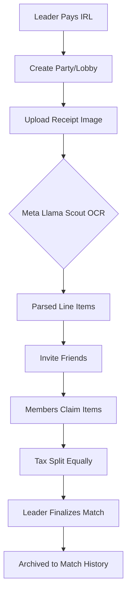
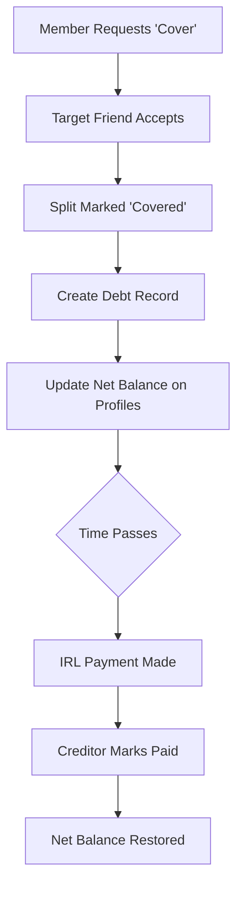

# BillShplit System Flows

This document contains the logic flows for the two primary systems in BillShplit: **The Match Lifecycle** and **The Debt/IOU System**.

## 1. The Match Lifecycle (Creation to History)
This flow describes how a bill is created, parsed, and finalized.

## 2. The Debt & "Web of Trust" Flow
This flow describes what happens when a user cannot pay their share immediately.

